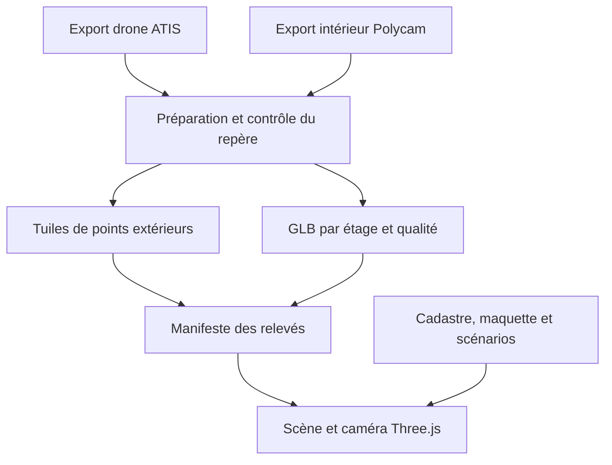

# Audit de l’intégration 3D du domaine de Grangues

Audit du 8 septembre 2026. Les observations techniques, les capacités documentées des fournisseurs et les propositions sont distinguées ci-dessous.

## Résultat et périmètre vérifié

Le site dispose déjà d’une scène Three.js géoréférencée, d’outils de conception et de références photographiques. Cette base convient à l’intégration de relevés, sans changement de moteur. Une première extension est préparée dans la branche `feat/unified-surveys` des sources disponibles du site.

Le dépôt demandé, [gvern/3D_Grangues](https://github.com/gvern/3D_Grangues), reste inaccessible. Le connecteur GitHub identifie bien le compte `gvern`, mais les lectures du dépôt et de son contenu répondent 404 ; les recherches ne le retournent pas. La lecture Git HTTPS non interactive échoue faute d’authentification. Cela ne permet pas de conclure que le dépôt n’existe pas. **Sa stack, ses fichiers, ses branches, sa CI et son lien éventuel avec le site ne sont pas établis. Aucune modification ni PR n’a été envoyée à ce dépôt GitHub.**

Pour [le site actuel](https://domaine-grangues-3d.gvern.chatgpt.site/), les métadonnées Sites indiquent une publication privée, version 3, issue du commit `2a6dfe37608b4f3138b7b3c3dcdaedf0a81c1019`. Les sources locales sont disponibles. La base de travail `7d0b92e` contient aussi les corrections ultérieures des buis et de l’escalier ; elle ne doit pas être confondue avec la version publiée. La nouvelle extension n’a pas été déployée. La tentative d’examen visuel de l’URL n’a pas fourni de résultat exploitable pendant cet audit.

Le partage ATIS fourni, version `base`, redirige dans le navigateur d’audit vers `/error/webgl2`. La page indique que WebGL 2 n’a pas pu être initialisé. Le nuage, les menus d’export et les fichiers sources n’ont donc pas pu être inspectés. Le nombre de points, les couleurs, l’emprise, la précision, le CRS, le datum vertical et les droits de téléchargement du partage restent inconnus.

## Stack et fonctionnement des sources disponibles du site

| Élément | Constat dans les fichiers |
|---|---|
| Frontend | HTML, CSS, modules JavaScript ; pas de React, de serveur applicatif ni de base de données |
| Moteur | Three.js 0.180.0, dépendances conservées dans `dist/vendor`, import map locale |
| Démarrage | `dist/index.html` charge `app.js`, qui lit `domain.json` et `photos.json`, puis l’orthophotographie et construit la scène |
| Géométrie | `scene.js` expose `buildDomain()`, les groupes du domaine, le terrain interpolé et les vues |
| Navigation | Caméra perspective, OrbitControls, cadrages prédéfinis, vue verticale avec nord en haut |
| Conception | Placement, dimensions, rotation de volumes ; teintes des façades et de la toiture |
| Persistance | Téléchargement/import explicite de scénarios JSON ; pas de sauvegarde automatique |
| Exports | Image du canvas, GLB via GLTFExporter, GLB initial disponible au téléchargement |
| Hébergement | Application statique `dist`, configuration `.openai/hosting.json`, publication privée Sites |
| Contrôles existants | Scripts de préparation géographique, vérification de la maquette et export GLB |

Le terrain utilise 12 870 échantillons IGN espacés de 10 m. Les 19 parcelles couvrent environ 43,279 ha. Les façades, toitures, aménagements et houppiers sont reconstitués : ce ne sont pas des surfaces mesurées issues du drone. La base locale comporte 31 photographies et un plan ; la publication antérieure précède les deux dernières références.

La géométrie locale vérifiée contient 49 meshes, 490 139 sommets et 5 278 instances pour 2 639 arbres. L’orthophotographie JPEG pèse 2 248 617 octets et le GLB initial 18 612 592 octets. Le GLB initial est un téléchargement ; le navigateur construit sa scène à partir des données et du code.

Le rendu actuel tourne en continu, avec pause lorsque l’onglet est masqué, pixel ratio plafonné à 1,6 et ombres 2048². Les objets statiques sont regroupés par matériau et les arbres utilisent l’instanciation. Il n’existait pas de streaming de points, de LOD spatial, de chargeur de scan intérieur ou de recalage de relevés.

## ATIS : formats documentés et accès effectivement constaté

| Opération | Documentation ATIS | Constat pour le partage fourni |
|---|---|---|
| Visualiser un projet partagé | URL publique ou iframe, paramètres du partage | Ouverture tentée ; erreur WebGL 2 |
| Télécharger les fichiers d’origine | Droit **Download data** | Droit et formats des fichiers non vérifiés |
| Exporter une zone dans le navigateur | LAS ou CSV | Non testé sur le partage |
| Exporter une zone côté serveur | LAS, E57 ou RCP ; récupération dans les fichiers du projet | Non testé ; droit **Export data** distinct |
| Importer des nuages dans ATIS | Notamment LAS, LAZ, E57, RCP/RCS, BPF, XYZ, LGSx | Ne prouve pas l’existence d’exports dans tous ces formats |
| Utiliser l’API | Activation par ATIS et clé ; documentation publique centrée sur transfert et gestion | Aucun accès API établi ; aucun endpoint de streaming exportable confirmé |

Les exports de zones et leur récupération sont décrits dans [Exporting Zones](https://webapp.atis.cloud/support/article/110). Les droits de téléchargement et d’export sont distincts dans [Grant Project Permission to Members](https://webapp.atis.cloud/support/article/5). Les formats d’import sont détaillés dans [Accepted File Types](https://webapp.atis.cloud/support/article/15).

ATIS documente un code iframe dans [Public Sharing](https://webapp.atis.cloud/support/article/35). Il peut servir à consulter le relevé d’origine. Les documents consultés ne démontrent pas une API de caméra permettant de fusionner cette vue avec la scène Three.js. L’architecture proposée intègre donc des fichiers exportés et préparés. L’[API de transfert](https://webapp.atis.cloud/support/article/103) nécessite une activation spécifique ; aucun appel privé n’a été deviné ou effectué.

## Architecture retenue

Conserver le terrain, le cadastre, les références, les orientations validées et les scénarios. Ajouter des adaptateurs de relevés à la scène et à la caméra existantes. Stocker les originaux et les dérivés volumineux hors Git, dans un stockage de fichiers avec un accès adapté au domaine privé.

**Extérieur.** Demander de préférence le nuage colorisé complet en E57 ou LAS, avec coordonnées et rapport de relevé ; LAZ convient aussi s’il est fourni comme original ou créé après export. Conserver cet original. Préparer un dérivé en 3D Tiles, avec hiérarchie spatiale et coordonnées locales. La première cible testée est 3D Tiles 1.0 avec contenu PNTS. Le choix réutilise [3D Tiles Renderer JS](https://github.com/NASA-AMMOS/3DTilesRendererJS), compatible avec Three.js, et sa gestion des tuiles, files de chargement et caches. Tous les profils et extensions 3D Tiles 1.1 ne sont pas validés ici.

**Intérieur.** Pour le futur export Polycam, privilégier un GLB texturé, découpé par étage ou zone navigable. Préparer un maillage léger et un maillage détaillé conservant exactement le même repère. Draco/Meshopt et KTX2 sont prévus par les chargeurs. Une capture Gaussian Splat PLY constitue un autre type de contenu : elle nécessite un adaptateur et des essais spécifiques. Un PLY de points ordinaire n’est pas un Gaussian Splat. Les exports PLY de splats et OBJ/GLB de maillage sont décrits par [Polycam](https://learn.poly.cam/hc/en-us/articles/41491673295508-How-to-Import-Your-Gaussian-Splat-Captures-into-Unity). Aucun export Polycam du château n’a été reçu.

**Navigation.** Une seule caméra et un seul renderer. La sélection d’un relevé rétablit son dernier cadrage, charge la représentation souhaitée et masque les groupes de la maquette explicitement remplacés. La bascule intérieur/extérieur libère la capture précédente. Les contrôles intérieurs autorisent des distances et un plan proche adaptés ; la contrainte de hauteur du terrain extérieur est suspendue. Le retour aux outils de conception restitue la maquette. Cette version utilise l’orbitation et des points de vue ; la marche avec collisions, les escaliers praticables et le passage continu par des portes nécessitent un maillage de collision ou de navigation ultérieur.

**Repère.** Le projet utilise EPSG:2154 avec origine `(E0,N0,H0) = (477616.19, 6910397.86, 112.79) m`. `X = E − E0`, `Y = H − H0`, `Z = N0 − N`. Le décalage doit être effectué avant conversion des coordonnées en Float32. L’altitude 112,79 m provient de la maquette IGN ; son rattachement vertical doit être confronté au relevé. Le logiciel ne transforme pas automatiquement une hauteur ellipsoïdale GNSS en altitude NGF.

Le recalage accepte une transformation rigide ; l’échelle uniforme est une option explicite. Le script fourni calcule une matrice par points homologues, conserve les résidus et distingue les points utilisés pour ajuster la matrice des points de contrôle indépendants. Les seuils de 5 cm de RMS d’ajustement et 10 cm d’erreur maximale de contrôle sont des critères de travail configurables, pas une précision annoncée du château. La [procédure Polycam avec points de contrôle](https://learn.poly.cam/hc/en-us/articles/45497478182036-How-to-Georeference-Polycam-Scans-Using-Ground-Control-Points-in-CloudCompare) fournit une référence de préparation. Les coordonnées estimées de la maquette ne remplacent pas des points mesurés.

## Implémentation et validation

La branche ajoute un manifeste contrôlé, deux adaptateurs réels (GLB et tuiles), un panneau « Relevés 3D », des profils de qualité, le retour à la maquette en cas d’erreur, l’annulation des chargements devenus inutiles et la libération des ressources. Les décodeurs sont conservés localement et chargés à la demande. Les scénarios et les scans restent séparés à l’export.

Le paquet npm sert uniquement à reconstruire les adaptateurs optionnels : le site reste statique. Versions figées : Three.js 0.180.0, 3d-tiles-renderer 0.5.2 et esbuild 0.25.12. Les deux bundles optionnels représentent environ 85 ko gzip au total ; les décodeurs WASM sont des fichiers supplémentaires chargés si nécessaires. Ce poids ne mesure pas celui des futurs relevés.

Les vérifications passent : 11 tests JavaScript, 4 tests Python, construction des bundles, syntaxe JavaScript et contrôle existant de la géométrie. Les tests utilisent des fichiers **synthétiques** : lecture GLB et PNTS sur serveur HTTP local, positionnement avec RTC, raffinement d’un niveau grossier vers un niveau détaillé à l’approche de la caméra, contrôle des tailles et erreurs HTTP, libération du cache, courses entre chargements, axes et recalage. Ces tests n’exécutent pas le rendu GPU.

Restent à valider avec les données : rendu visuel, décodage GPU des textures compressées, trous de couverture, qualité du raccord intérieur/extérieur, débit, temps de première vue, mémoire et FPS sur ordinateurs et téléphones réels. Aucun chiffre de performance du nuage ATIS n’est avancé.

Le [guide d’intégration](INTEGRATION-RELEVES.md) détaille les fichiers, le contrat des données, les budgets et le raccordement à GitHub. La [fiche de réception](RECEPTION-RELEVES.md) précise les exports et informations à obtenir.
